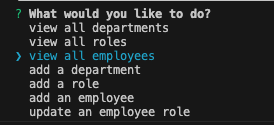
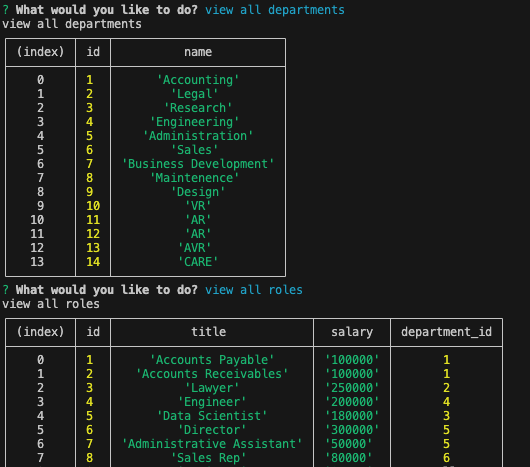

# Employee-Management-System

## Building an Employee Management System

The purpose of this project is to create a database using MYSQL. In the database, three tables are created and they are: department, role, and employee. Developing this project demonstrates our back-end development skills using mysql, Nodejs, and inquirer.
This project was developed with Inquirer version 8.2.4. Using Inquirer assisted in forming and structuring of our questions and responses. Along Inquirer, MySql was used for table creation, table seeding, and the management of data. 

The following is an image of the options a user has to use the application.

The Following image are example of the tables generated from the application used to create and/or access the table data.

## Installation

N/A

## Usage

To view the application in action, simply click the following link: https://drive.google.com/file/d/17AQ60uppJPP6STA0J1GSJfh07FWNfR-t/view?usp=drive_link
The link will redirect you to a video demonstration of the application in action. The employee-management-system application functionality generates specific questions to define the specific data wishes to view, create, or update. 

## Credits

N/A

## License

Please refer to the LICENSE in the repo.